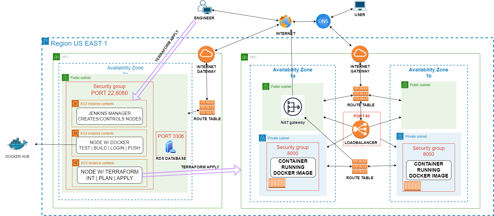
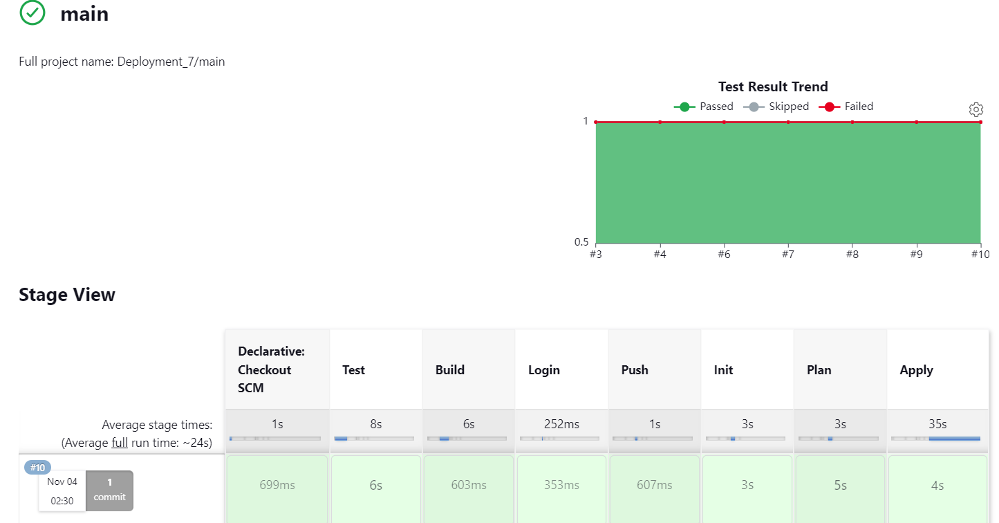

# Banking Application Deployment on AWS with Docker image
### November 04, 2023
### Kevin Gonzalez

## Table of Contents
- [Purpose](#purpose)
- [Infrastructure Diagram](#infrastructure-diagram)
- [Git Branch and Git Push](#git-branch-and-git-push)
- [RDS](#rds)
- [Jenkins Infrastructure (ec2.tf)](#jenkins-infrastructure-ec2tf)
- [Jenkins Setup](#jenkins-setup)
- [Credentials for Jenkins](#credentials-for-jenkins)
- [Dockerfile](#dockerfile)
- [Application Infrastructure Resources](#application-infrastructure-resources)
- [Jenkins Pipeline](#jenkins-pipeline)
- [Optimization](#optimization)
- [Conclusion](#conclusion)

## Purpose
The goal of this deployment is to launch a banking application within the AWS network, leveraging Terraform and Jenkins to automate infrastructure provisioning. The application's source code is cloned from GitHub using Git, and the application's image is created using a Dockerfile. The image is then later used with a container to host the app.

## Infrastructure Diagram

## Git Branch and Git Push
Git is a commonly used command-line tool that helps developers track changes in their codebase. Git allows you to create and manage repositories that store the history of your project, including all the changes made to it over time. VSCode was used to visually aid the [Git](https://github.com/kevingonzalez7997/Git_Cloning.git) processes. 

## RDS 
Amazon Relational Database Service (Amazon RDS) is a managed web service that makes it easier to set up, operate, and scale a relational database in the AWS Cloud. It is referenced to the application to ensure continuity of user data across tasks. It's essential to [reference](https://github.com/kevingonzalez7997/Automate_Terraform_with_Jenkins_D6/blob/East/format.png) the database in every aspect of the application that interacts with it, includ the username, password, and endpoint. 

## Jenkins Infrastructure (ec2.tf)
The infrastructure for Jenkins is defined in the [ec2.tf](Jenkins_files/ec2.tf) file. This infrastructure consists of three EC2 instances:

1. **Jenkins Manager**: This instance is responsible for managing and controlling the other nodes.
2. **Docker Node**: This node is equipped for tasks such as testing the application, building the Docker image, and pushing the image to Docker Hub.
3. **Terraform Node**: This node handles the provisioning of the entire application infrastructure.

[Scripts](Jenkins_files) have been prepared to install the necessary files on each instance.

## Jenkins Setup
Jenkins, an open-source automation server, plays a central role in building, testing, and deploying code while efficiently distributing workloads. In this setup, the nodes are allocated specific responsibilities:

- **Docker Node**: Performs tasks such as testing the application, building the Docker image, and pushing it to Docker Hub.
- **Terraform Node**: Focuses on creating the entire application infrastructure.

To complete these tasks, two new nodes are created:

1. Specify the name and location.
2. Select "Launch agent via SSH" and utilize the previously generated SSH key for secure communication.
3. Specify the public IP of the 'docker_node' and 'Jenkins_node' EC2 instances as the host.
4. Create credentials by entering the private key directly.
5. Save and check the agent's status in the log.

In addition, two plugs-in are also installed :
Docker Pipeline
Pipeline keep running

## Credentials for Jenkins
To ensure Terraform has the necessary access to AWS, it requires both AWS access and secret keys. Since the main.tf files are hosted on GitHub but shouldn't have public access for security reasons, Jenkins credentials are created for AWS. Similarly, credentials are created for Docker Hub with a username and password:

For AWS:

- Navigate to **Manage Jenkins > Credentials > System > Global credentials (unrestricted)**.
- Create two credentials for access and secret keys as "Secret text."

For Docker Hub:

- Navigate to **Manage Jenkins > Credentials > System > Global credentials (unrestricted)**.
- Create credentials for access and secret keys using DockerHub-generated key and username.

## Dockerfile
Creating Docker images with Dockerfiles offers a consistent way to package and distribute applications. This approach ensures applications run consistently across different environments, mitigating configuration drift.

The [Dockerfile](dockerfile) is created to build an image of the application. This step follows the testing stage on the `docker_node` EC2 and involves building and pushing the image to Docker Hub, a cloud-based service that hosts Docker images. This is possible due to the creation of Jenkins credentials.

## Application Infrastructure Resources
These resources are defined across three distinct .tf (Terraform) files, each serving a specific role in creating the environment for the application:

### vpc.tf

The [vpc.tf](intTerraform/vpc.tf) file is the infrastructure, creating a comprehensive network environment for the application. It includes the following components:

- **Virtual Private Cloud (VPC)**: The networking framework that manages resources.
- **Availability Zones (2 AZs)**: Providing redundancy and fault tolerance by distributing resources across different AZs.
- **2 Public Subnets** :  
- **2 Private Subnets**: Subnets isolated from the public internet, for sensitive data
- **NAT Gateway**: A network gateway for egress traffic from private subnets to the internet.
- **2 Route Tables**: Routing rules for traffic between subnets.
- **2 Security Groups**: 80 for ALB and 8000 for container

### main.tf

The [main.tf](intTerraform/main.tf) file creates the environment for the application. It includes:

- **Cluster**: The container for application tasks.
- **Task Definition**: Configuration specifying how application containers will be created and from which image
- **Service**: Ensures the desired number of tasks to be running at all times
- **Connection to Load Balancer**: Establishes a connection to the application load balancer, ensuring proper traffic distribution and high availability as well as ingress traffic

### alb.tf

The [alb.tf](intTerraform/ALB.tf) file focuses on configuring the Application Load Balancer (ALB) and its related components. It includes:

- **Target Group**: Manages the destination for load balancer traffic, ensuring that traffic is correctly routed to the application environment. Port 8000 is the application ingress route.
- **ALB (Application Load Balancer)**: Serves as the entry point for incoming requests, balancing traffic among application instances, in private subnets.
- **Listener and Routing Rule**: Configures a listener on port 80, with rules that forward traffic to the appropriate target group, ensuring proper distribution of incoming requests.

## Jenkins Pipeline

GitHub is one of the most popular open-source repository platforms. The code will be pulled from a GitHub repository that has been created, which is a more practical approach.

- Create a new Jenkins item and select "Multi-branch pipeline."
- Configure Jenkins Credentials Provider as needed.
- Copy and import the Repository URL where the application source code resides.
- Use your GitHub username and the generated key from GitHub as your credentials.
- Run .

### Pipeline Steps

### Test Stage (docker_node)
In this stage, the application is tested on the `docker_node` EC2 instance. Any errors are identified and addressed during this phase.
### Build Stage (docker_node)
The build stage focuses on building the Docker image. The Dockerfile is used to create a container image that encapsulates the application and its dependencies. This image serves as a consistent package for the application.

### Login to Docker Hub (docker_node)
After the image is built, it will get pushed by logging into Docker Hub. This is made possible through credentials installed on Jenkins, allowing for secure interactions with the Docker Hub service.

### Push to Docker Hub (docker_node)
Once the image is successfully created, it is pushed to the Docker Hub repository. This step makes the Docker image available for distribution and deployment.

### Initialize (terraform_node)
The pipeline transitions to the `terraform_node`, The initialization phase sets the groundwork for Terraform to manage the infrastructure.

### Plan (terraform_node)
Terraform performs a planning phase to analyze and determine the resources needed during infrastructure provisioning. This includes identifying resources to be created or destroyed based on the provided configuration.

### Apply (terraform_node)
The apply phase executes the provisioning tasks based on the plan stage. It basically uses magic to create the application infrastructure. Terraform returns a detailed summary of what resources have been successfully created.

## Optimization
**Auto-Scaling**: Implement auto-scaling to dynamically adjust the number of container instances based on traffic patterns. Auto-scaling ensures the application's performance even during traffic spikes.

**Enhance Fault Tolerance**: To mitigate the single point of failure associated with the current single NAT gateway, implement a second NAT gateway in AZ 1b. This approach increases redundancy and reduces the risk of downtime if one of the NAT gateways becomes unavailable.

**Geographical Redundancy**: Duplicating the entire infrastructure in a different AWS region would further increase resilience. This provides a failover in case a whole region experiences an outage, ensuring continued availability of the application.

## Conclusion 
The banking application deployment on the AWS network leverages Terraform and Jenkins to establish a fault-tolerant and secure infrastructure. Terraform's configuration settings ensure that when a container instance shuts down, another is created, guaranteeing uninterrupted service. The use of private subnets, along with DNS instead of public IP addresses and port numbers, enhances security and reduces vulnerabilities. 

In this infrastructure, there is strong fault tolerance. When one container instance is terminated, the architecture automatically promotes the creation of another to ensure the continuity of services. This redundancy is achieved through Terraform's configuration settings under the '# ECS Service' section, where 'desired_count' is set to 2 and 'force_new_deployment' is enabled. The 'scheduling_strategy' is set to 'REPLICA,' ensuring that replica containers are spun up to maintain 2 running at all times. The containers are deployed within the private subnets, enhancing the overall security. In addition, public IP addresses and port numbers are not exposed; instead, a DNS-based approach is applied. 
